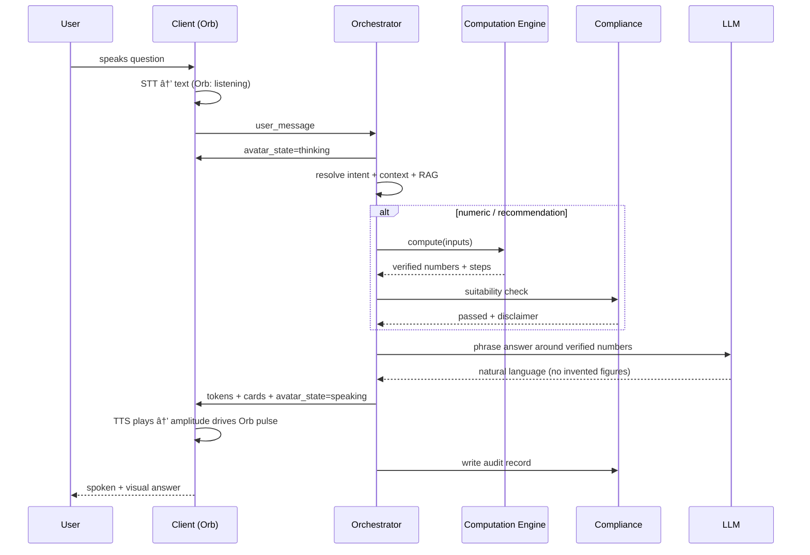
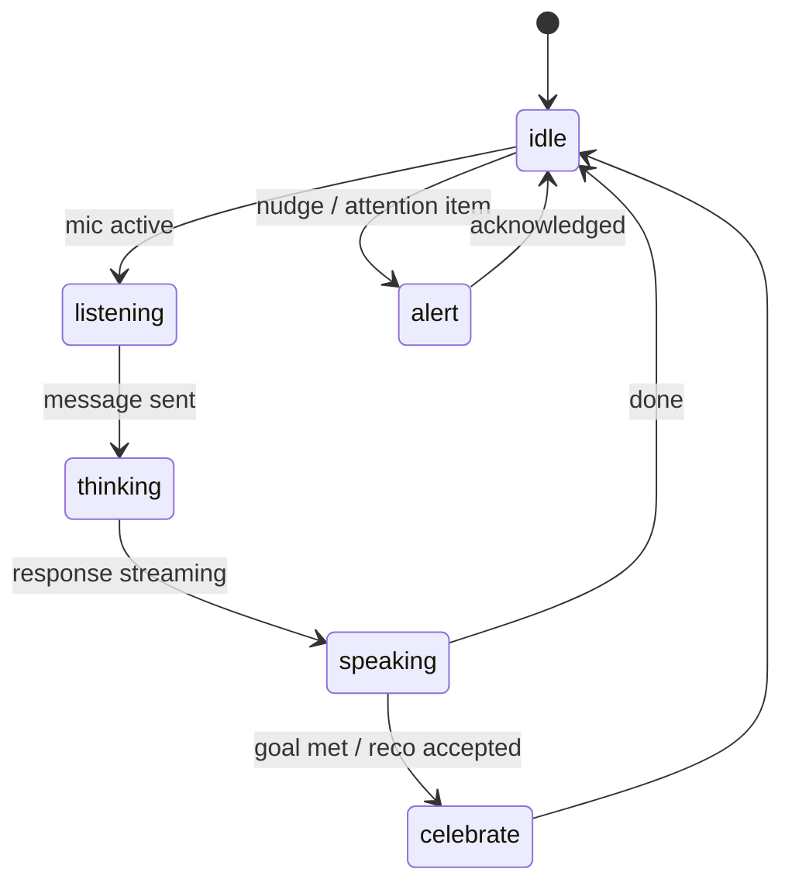
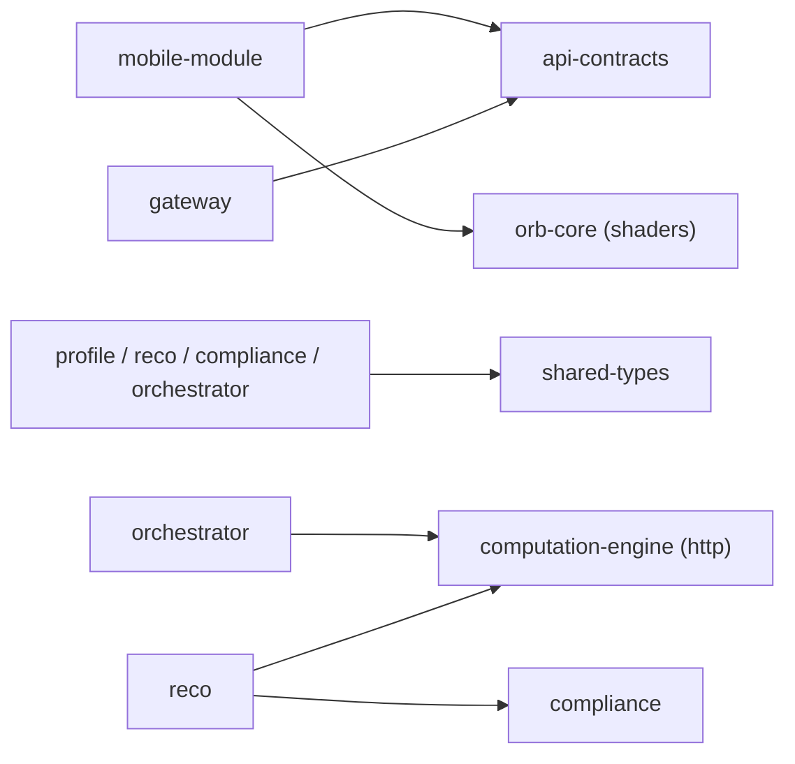

Status: 📋 PLANNED

# Architecture Diagram

## System context

```mermaid
flowchart TB
    User([Bank Customer])
    subgraph Client["Bank Mobile App"]
        Module["WealthOrb Module"]
        Orb["3D Orb Renderer<br/>(no face, audio-reactive)"]
        Audio["Audio I/O<br/>STT capture / TTS playback"]
    end

    Gateway["API Gateway<br/>auth · rate-limit · audit hook"]

    subgraph Services["Backend Services"]
        Orchestrator["Conversation<br/>Orchestrator"]
        Profile["Profile Service"]
        Reco["Recommendation<br/>Engine"]
        Compute["Computation Engine<br/>(deterministic math)"]
        Compliance["Compliance Service<br/>suitability · audit"]
    end

    LLM["LLM + RAG"]

    subgraph Data["Data Layer"]
        PG[("Postgres")]
        Redis[("Redis")]
        Vec[("Vector DB")]
    end

    Core["Bank Core<br/>(read-only)"]

    User --> Module
    Module --> Orb
    Module --> Audio
    Module -->|HTTPS / WSS| Gateway
    Gateway --> Orchestrator & Profile & Reco & Compliance
    Orchestrator --> LLM
    Orchestrator --> Compute
    Reco --> Compute
    Reco --> Compliance
    Orchestrator --> Compliance
    LLM --> Vec
    Services --> PG
    Services --> Redis
    Profile -->|secure feed| Core
```

## Advisory turn (sequence)

## Avatar state machine

> Note: every transition is a discrete event from the orchestrator. `speaking` visuals come from client-side TTS audio amplitude — **no lip-sync, no visemes**.

## Monorepo dependency direction

